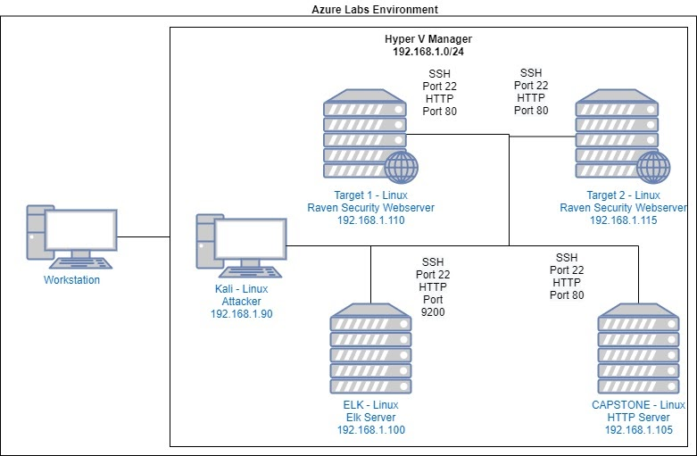

# Blue Team: Summary of Operations

## Table of Contents
- Network Topology
- Description of Targets
- Monitoring the Targets
- Patterns of Traffic & Behavior
- Suggestions for Going Further

### Network Topology

The following machines were identified on the network:
- Name of VM 1 Capstone VM 
  - **Operating System**: Linux
  - **Purpose**: Contains the Filebeat and metric beats and forwards the logs to the ELK Server
  - **IP Address**: 192.168.1.105

- Name of VM 2  ELK Server 
  - **Operating System**: Windows 10
  - **Purpose**: Contains the Kibana Dashboard to analyze the network Traffic
  - **IP Address**: 192.168.1.100

- Name of VM 3  KALI Linux 
  - **Operating System**: Linux
  - **Purpose**: Used for the pentesting and getting access to the Target Machines
  - **IP Address**: 192.168.1.90

- Name of VM 4  Target 1 
  - **Operating System**: Linux
  - **Purpose**: Contains the vulnerable Word press server that we were going to explore
  - **IP Address**: 192.168.1.110

- Name of VM 5  Target 2 
  - **Operating System**: Linux
  - **Purpose**: Contains the vulnerable Word press server and we use the exploit to access the machine
  - **IP Address**: 192.168.1.115

### Description of Targets

The target of this attack was: `Target 1` 192.168.1.110.

Target 1 is an Apache web server and has SSH enabled, so ports 80 and 22 are possible ports of entry for attackers. As such, the following alerts have been implemented:

### Monitoring the Targets

Traffic to these services should be carefully monitored. To this end, we have implemented the alerts below:

#### Name of Alert 1
_

Alert 1 is implemented as follows:
  - **Metric**: http.response.status_code 
  - **Threshold**: 400
  - **Vulnerability Mitigated**: Failed Login attempts and viewing the access to the server
  - **Reliability**: HIGH When we can view where the http requests are coming from, and the error code that is being given, then we can know what exactly is happening on the network.

#### Name of Alert 2
Alert 2 is implemented as follows:
  - **Metric**: http.request.bytes
  - **Threshold**: 3500
  - **Vulnerability Mitigated**: Checks the amount of data that is being taken of the system and this can be a good way to prevent loss of vital company data
  - **Reliability**: Medium, Some files that are sent or received could be high and this could give a false metric unless you know what exactly the file contains

#### Name of Alert 3
Alert 3 is implemented as follows:
  - **Metric**: system.process.cpu.total.pct
  - **Threshold**: 0.5
  - **Vulnerability Mitigated**: Helps to detect the number of programs that are running on the system, and if their are unwanted programs the cpu usage will be very high 
  - **Reliability**: HIGH (Some Programs can actually be CPU intense and this can give false positives, but ideally a machine that is slowed down most times has unwanted programs running in the background, because whe the machines are set up, we account for the amount of processing power that is required)

### Suggestions for Going Further (Optional)

The logs and alerts generated during the assessment suggest that this network is susceptible to several active threats, identified by the alerts above. In addition to watching for occurrences of such threats, the network should be hardened against them. The Blue Team suggests that IT implement the fixes below to protect the network:
- Vulnerability 1  Enumeration of users
  - **Patch**:  
To stop user enumeration in word press, we have to do 2 things
1.  Disable the scans; This is done by adding a code snippet to the theme’s function.php file and the site’s root .htaccess file 

This code is added to the function.php
// block WP enum scans
// https://m0n.co/enum
if (!is_admin()) {
	// default URL format
	if (preg_match('/author=([0-9]*)/i', $_SERVER['QUERY_STRING'])) die();
	add_filter('redirect_canonical', 'shapeSpace_check_enum', 10, 2);
}
function shapeSpace_check_enum($redirect, $request) {
	// permalink URL format
	if (preg_match('/\?author=([0-9]*)(\/*)/i', $request)) die();
	else return $redirect;
}
This code is added to the .htaccess file
# Block User ID Phishing Requests
<IfModule mod_rewrite.c>
	RewriteCond %{QUERY_STRING} ^author=([0-9]*)
	RewriteRule .* http://example.com/? [L,R=302]
</IfModule>
2.  We Need to make sure the theme does not display the login user names  by changing all user displays to anything other than the login name, making sure any author/user template tags are not displayed and disabling author/user archive entities if they are not needed

This works because without the user name to use, its difficult to bruteforce both user name and password

- Vulnerability 2 Weak Passwords

Using password protection service on most Server Machines, both Linux and Widows Servers have the ability to set the minimum standards for the passwords
This Can be done by ensuring the password is set to a minimun standard with a set number of letters, numbers and special characters

Password Protection for Active Directory, for both on premise and Azure Active Directory

- Vulnerability 3 Unprotected and Unsalted Hashes
 
This can be overcome by using long salted hashes
 

- Vulnerability 4 Root escalation
  - **Patch**:  Password policies (ensure passwords and complex and changed frequently) Using Least privilege principle, ensuring strong passwords, Keep your systems and applications patched and updated, Change default credentials on all devices
  